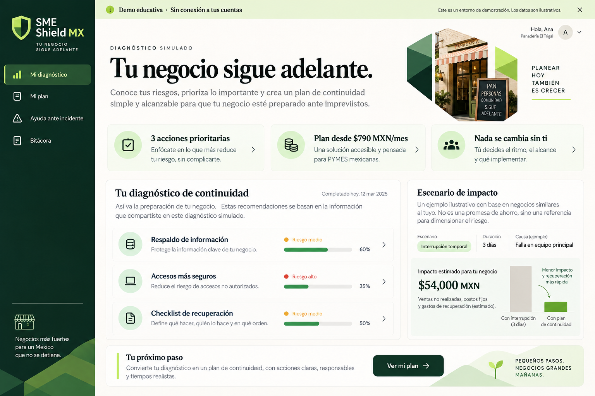
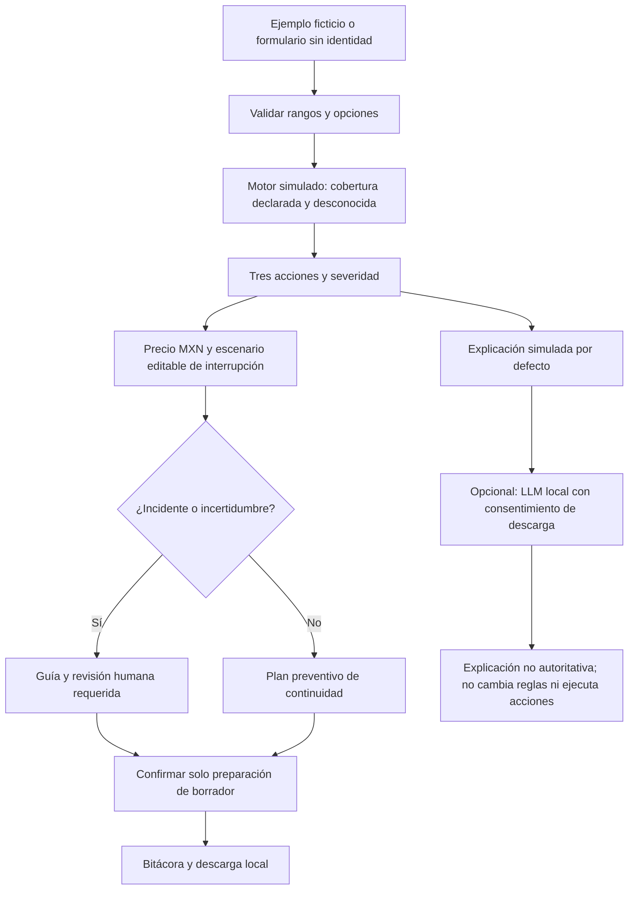
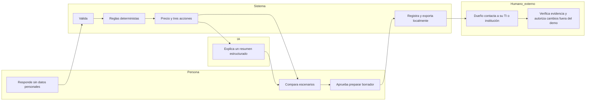

# SME Shield MX · Packet antes de código
**Emiliano Carballido · MONEY · Business Bending Week 8**

Fecha de diseño: 4 de octubre de 2026. Este documento y su mockup se incorporan en un commit anterior a cualquier código de aplicación. El historial Git, no una fecha escrita a mano, es la evidencia de secuencia. Base del repositorio: `78c4caf` (solo licencia y .gitignore).

## Problema, en mis palabras
Una pyme no compra alertas: necesita seguir cobrando, atender clientes y recuperar su operación. Un dueño sin equipo de seguridad no puede convertir una lista de riesgos en una decisión mensual comprensible. Este slice convierte un autodiagnóstico en tres siguientes pasos y una hipótesis de paquete con precio visible, límites y escenario de interrupción. No prueba que el negocio esté protegido.

## Usuario exacto
Dueña o dueño de una organización mexicana de 5 a 25 personas; usa WhatsApp, correo y equipos compartidos, depende de archivos y ventas digitales y compra servicios a través de su contador o proveedor de TI. Persona sintética de prueba: Patricia, 49 años, administra una papelería de 8 personas, no sabe distinguir una copia de archivos de una recuperación probada, teme cargos ocultos y tiene tres minutos. No se han entrevistado usuarios reales; estas son hipótesis basadas en el Brief y Blueprint.

## Definición de éxito
Antes de cerrar el módulo, una persona puede abrir una URL pública, completar un diagnóstico sin credenciales, ver exactamente tres acciones priorizadas, comprender el precio mensual ilustrativo y sus exclusiones, comparar el costo con horas de interrupción hipotéticas, preparar una revisión humana sin que se envíe ni ejecute nada, y descargar su resumen. Los datos del negocio no se persisten ni se transmiten a un servidor. La app muestra cobertura desconocida, resultados simulados y un registro de sesión visible.

## Mockup generado por imagen

Concepto visual generado con la herramienta de imágenes de Codex: fondo marfil, navegación verde bosque, acento lima, controles de continuidad y resumen económico. Es una imagen conceptual, no evidencia de funcionalidad. El prompt íntegro y procedencia se guardan en `docs/MOCKUP_PROMPT.md`.

## Flujo

## Responsabilidades / swimlane

## Benchmark investigado
La mejor referencia existente para este slice, a juicio de diseño y no como ranking universal, es **Huntress**, por combinar tecnología defensiva, SOC humano y venta a través de proveedores. Mi propuesta se diferencia por un flujo español para 5-25 personas, hipótesis de precios en MXN, escenarios de continuidad y derivación mexicana; no pretende ofrecer la detección real ni el SOC de Huntress.

Consulta primaria 4-oct-2026: https://www.huntress.com/pricing . La página muestra MSRP EDR USD 8.99 por endpoint/mes y un ejemplo de USD 7.99 para 100 endpoints; no confundir el ejemplo con una cotización para ocho personas. Incluye SOC 24/7; la operación/integración del partner es distinta. No convertimos divisas ni inferimos que nuestros planes equivalen a EDR.

Referencia de controles: NIST Small Business Cybersecurity Corner, https://www.nist.gov/itl/smallbusinesscyber y guía CSF 2.0 https://nvlpubs.nist.gov/nistpubs/SpecialPublications/NIST.SP.1300.pdf . Se usa para organizar acceso, recuperación y respuesta; no se afirma certificación ni un score NIST.

Canal mexicano verificado: Guardia Nacional CERT-MX, orientación de ciberdelitos por **088**, publicación 29-ene-2026, https://www.gob.mx/gncertmx/articulos/en-caso-de-ser-victima-de-algun-ciberdelito-llama-al-088-atencion-ciudadana . No prometemos investigación ni recuperación; la denuncia formal corresponde a las autoridades competentes. Fraude bancario: contactar al banco mediante su app/teléfono oficial, sin enlaces enviados por supuestos asesores.

## Charter ligero: tres años, tres frases
En el año uno validaremos con pymes y contadores si un paquete entendible logra renovación a tres meses, con pruebas reales de recuperación y consentimiento acotado. En el año dos integraremos proveedores con permisos de lectura mínimos, playbooks y revisión humana para excepciones, midiendo costo de servicio y tiempos de recuperación. En el año tres aspiramos a una red mexicana de continuidad distribuida por TI, contadores y asociaciones, manteniendo trazabilidad y evitando que el crecimiento convierta la defensa en control opaco.

## Hipótesis MONEY y fórmulas
Paquetes conceptuales, no una oferta de venta: Esencial $790 MXN/mes para 5-10 personas; Continuidad $1,490 para 11-25. Totales ilustrativos incluyen impuestos, sin plazo forzoso ni cargo automático. Esencial: revisión mensual de acceso, checklist de respaldo, guía de recuperación, 30 min/mes de revisión humana propuesta. Continuidad: lo anterior, ensayo trimestral de recuperación y 60 min/mes. Licencias de terceros, almacenamiento, respuesta forense y SOC 24/7 excluidos. No hay servicio humano activo en la demo.

Escenario: ingreso diario hipotético / 8 horas = ingreso por hora; horas de interrupción × ingreso por hora = ingreso potencial interrumpido, no pérdida neta ni pérdida esperada. Horas equivalentes = precio mensual / ingreso por hora. Ingreso cero debe mostrar «No calculable» en vez de Infinity; no se da ROI garantizado ni probabilidad inventada. Costos internos a validar: Esencial 250 herramientas + 150 revisión + 120 operación + 79 distribución = 599; contribución 191 (24.2%). Continuidad 500 + 300 + 180 + 149 = 1129; contribución 361 (24.2%). Son supuestos, no proveedores contratados ni cotizaciones. Canal seleccionado cambia el mensaje de distribución, nunca inventa una afiliación. Piloto: probar 10 pymes durante tres meses, costo de atención, comprensión de precio, renovación y disposición a pagar; no inferir validación de una persona sintética.

## Scope cut
No antivirus, gestor de contraseñas, escáner de red, conexiones reales, backups reales, cobros, autenticación, tickets enviados, SOC o recuperación garantizada. Se representa onboarding de cuentas con selecciones declaradas (correo, respaldo, acceso), no OAuth; cualquier conexión futura debe pasar revisión de scopes. No se recopilan nombres, correos, RFC, CURP, expedientes, contraseñas, PIN, e.firma ni credenciales. La app es un planificador educativo: las condiciones del Blueprint son límites del diseño, no afirmaciones de que la operación completa ya existe.

## Arquitectura / DRAGON
| Capa | Stack gratis | Responsabilidad y frontera |
|---|---|---|
| Interfaz | HTML/CSS/JS + Vite | Español, accesible, responsive; datos volátiles |
| Seguridad | Motor propio de reglas simulado | Estados sí/no/no sé; umbrales transparentes; tres prioridades |
| LLM | WebLLM, modelo abierto pequeño en WebGPU | Opt-in y descarga local; no secretos; explica sin herramientas; fallback marcado como simulado |
| Datos y automatización | Objeto validado + playbooks JSON + exportación local | Estructura de negocio no identificable; bitácora en memoria; preparación de borrador explícita |
| Hosting | Vercel plan gratuito compatible con demo educativa | HTTPS, headers y deploy desde GitHub |
| Calidad | node:test + navegador automatizado | Reglas, precio, límites, flujo y responsive |

WebLLM exige navegador con WebGPU y descarga de pesos: https://webllm.mlc.ai/docs/user/get_started.html . El modo simulado sigue disponible y nunca se presenta como inferencia real. El LLM no decide riesgo ni precio y no puede ejecutar acciones. CSP permite solo los orígenes necesarios para los pesos/librerías; no analytics. Si no podemos verificar inferencia real, se documentará la limitación explícitamente.

## Blueprint: condiciones y aceptación
1. Onboarding corto sin especialista: formulario estructurado, ejemplo ficticio, «no sé» y cobertura desconocida; integraciones reales fuera del slice.
2. Vender continuidad: costo mensual total, recuperación, prioridades y escenario, no miedo ni score como probabilidad.
3. Excepciones: incidente activo y controles desconocidos requieren revisión humana; no ejecución ni contacto automático.
4. Conectar canales: orientación 088 y banco oficial; usuario contacta fuera de la app.
5. Escala: reglas, paquetes, playbooks y umbrales reutilizables; medir atención humana en piloto futuro.
6. Sombra: cero credenciales, sin privilegios sobre cuentas, registro visible y aprobación para preparar borrador. Cambios críticos son imposibles en este slice.

El Blueprint original está marcado como draft y deja pendiente la declaración de TECHNOLOGIST; no la inventamos. Dissent preservado: USER/ADVERSARY prefieren Breach-Victim y cuestionan pago preventivo; por eso hay incidente, precio transparente y canales de distribución hipotéticos. No repetimos cifras macro del Crystal Ball como hechos verificados.

## Security floor antes de construir
- Sin secretos ni API keys; LLM local opcional.
- Sin datos personales persistidos: sin DB, auth no aplica. Si se añade persistencia personal, bloquear release hasta implementar Google/Supabase Auth.
- Sin Supabase: RLS no aplica; requerido antes de cualquier tabla futura con datos de usuario.
- Validación de tipos, enums, finitos y rangos; no texto libre ni prompts crudos. Salidas de IA vía textContent.
- Solo seed ficticio, marcado. Logs no incluyen datos sensibles. Exportación iniciada explícitamente por usuario.

## Plan de pruebas previo al código
Mecánico: límites 5 y 25 personas, fuera de rango/NaN/campos extra, ingreso cero, precio por tramo, incidente anula nivel preventivo, «no sé» nunca equivale a seguro, exactamente tres acciones únicas, borrador exige aprobación y no red, reset borra estado y bitácora, descarga coherente, navegación/teclado, viewport móvil, CSP y sin errores de consola. Prueba LLM: no WebGPU/falla descarga conserva diagnóstico y etiqueta simulada; intento real si el equipo lo soporta. Ingresar valores adversarios y asegurar que ninguna salida ejecuta HTML.

Dos deploys mínimos: primera versión usable; prueba mecánica, reproducir bug real y añadir regresión; persona fresca ve capturas en orden, registra confusiones, corregir la peor; segundo deploy y smoke público. No inventar un bug ni una ejecución de modelo que no ocurrió. Evidencia: hashes, URLs, capturas, salida de tests y limitaciones en docs/evidence y DECISIONS.md.

## Entregables y cierre
README, este packet inmutable en primer commit, prompt de build separado, app, decisiones, tests, informe de persona, PDFs y guion. BUILDCHAT debe distinguir transcript literal disponible de resumen reconstruido; no etiquetar un resumen como conversación completa. Video: guion de ~3:30 (3 min de recorrido + 30 s reflexión) y variante corta de ~3 min si se requiere; grabación de voz de Emiliano pendiente si no se puede realizar aquí.
